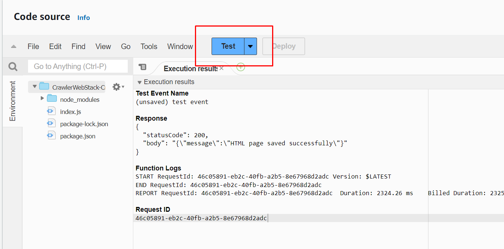

# Chatbot Agent with Amazon Bedrock

This project is based on the demo presented during my talk at AWS Summit Jakarta 2024 (September 5, 2024).

## The Architecture


## Prerequisites

1. **AWS Account**: Ensure you have an active AWS account.
2. **AWS CLI Configuration**: Set up your AWS CLI with the necessary credentials.
3. **Frontend Setup**: Place your frontend web application with chatbot functionality inside the `./src/web/public` directory.
4. **Model Access**: Make sure you already request model access the model you are going to use in your Amazon Bedrock Console in AWS `us-east-1` region.
   .
5. **Environment Variables**: Configure the following in the `.env` file:

   ```sh
   AWS_REGION=us-east-1

   # Get your Pinecone credentials from https://www.pinecone.io/
   PINECONE_CONNECTION_STRING=<pinecone connection string>
   PINECONE_API_KEY=<pinecone API key>

   CRAWL_TARGET_URL=<your target URL, obtained after deploying your frontend stack or using your custom domain>

   FROM_EMAIL=<sender email for notifications, must be configured in Amazon SES>
   EMAIL_DOMAIN=<email domain identity, also configured in Amazon SES>
   ```

## Deployment Steps

1. **Clone the Repository**: 
   ```sh
   git clone <repository-url>
   cd <repository-directory>
   ```

2. **Install Dependencies**: 
   ```sh
   npm install && npm install --prefix src/crawler
   ```

3. **Deploy the Stacks**: 
   ```sh
   cdk deploy KnowledgeBaseStack CrawlerWebStack AgentStack QueryStack
   ```
   The deployment process will start as shown below:
   

4. **Configure Frontend**: 
   - Once the deployment is complete, you will receive the chatbot API endpoint (highlighted in blue).
   
   - Copy the endpoint URL and update your frontend configuration.
   

5. **Deploy Frontend**: 
   ```sh
   cdk deploy FrontendStack
   ```
   - After the deployment, you will receive a CloudFront URL to access your frontend.
   

## Running the Application

1. **Prepare Knowledgebases**: 
   - Load documents into Amazon Bedrock from the S3 Bucket.
   - Alternatively, you can wait for EventBridge to trigger the Lambda function to crawl your web, or manually invoke the `CrawlerWebStack` Lambda function.
   

2. **Interact with the Chatbot**: 
   - Allow Amazon Bedrock a few minutes to process your files.
   - Test the chatbot either through your frontend or via the Amazon Bedrock Management Console.
   
